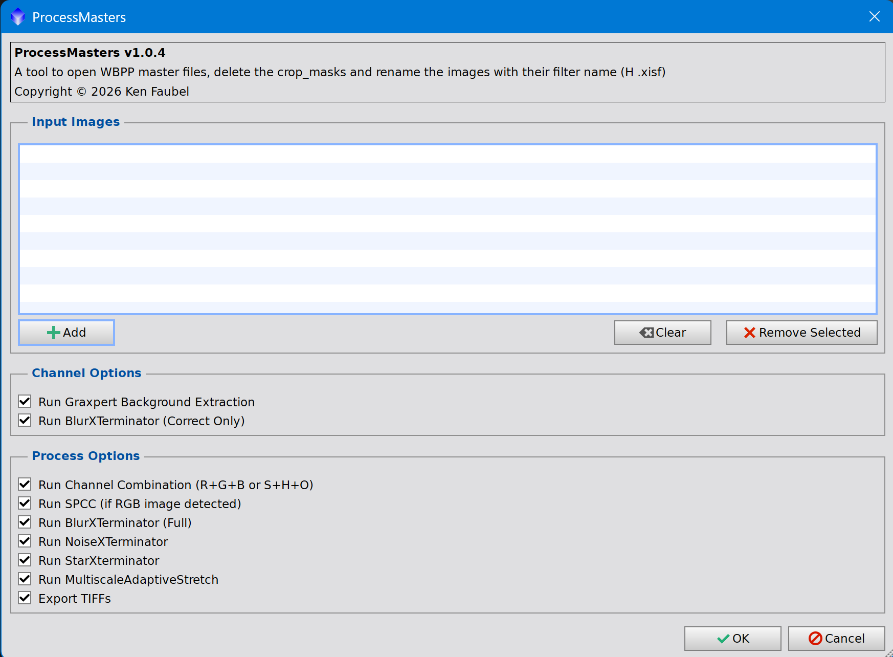

# ProcessMasters

Simple PixInsight script for post WBPP processing.



## What the script does

`ProcessMasters.js` automates early post-integration processing for WBPP master files.
It is designed to take channel masters (L, R, G, B, H, S, O), clean up workspace artifacts,
run common AI-assisted correction steps, and produce combined masters for downstream processing.

In practical terms, it can:

- Open selected master files and close `crop_mask` windows.
- Detect filter type from WBPP-style file names and rename images to `L`, `R`, `G`, `B`, `H`, `S`, `O`.
- Apply optional per-channel processing such as GraXpert background extraction and BlurXTerminator (correct-only).
- Combine channels into `RGB` (R+G+B) and/or `SHO` (S+H+O) when available.
- Run optional post-combination processing: SPCC (for RGB), BlurXTerminator full, NoiseXTerminator, and StarXTerminator.
- Save outputs back to the source directory, including starless/stars variants where applicable.
- Save TIFF images for import into tools like Affinity.

## How it works
The script separates UI and processing logic.
The dialog lets you choose input files and options, then the processing engine runs a staged workflow:

1. Load each selected image and normalize naming/windows.
2. Process each channel master.
3. Combine channels into RGB/SHO when possible.
4. Apply optional finishing steps on combined images (and luminance if present).
5. Write `.xisf` outputs with predictable names.

## Files

- `ProcessMasters.js`: PixInsight script source.
- `deploy.sh`: Copies `ProcessMasters.js` to PixInsight's script directory.

## Local Deploy

This deployment targets:

`C:\Program Files\Pixinsight\src\scripts\ktf\`

Because this location is under Program Files, run from an elevated (Administrator) shell.

### Bash

```bash
bash deploy.sh
```

If not run as Administrator, `deploy.sh` exits with an error.

## Public Deployment
Run release.bat (Major|<Minor|Patch)   - Update the version, generate the release.zip file and generate the SHA1 hash for the release.zip file.

### Install into Pixinsight
- Add a new repository to PixInsight's Script Repository Manager: "https://raw.githubusercontent.com/kfaubel/ProcessMasters/main"
- Run Checdk for Updates in the Script Repository Manager to fetch the latest version of ProcessMasters.js
- Restart PixInsight and ProcessMasters.js will be available in the Script menu.

## Requirements

- Windows
- Bash (for example Git Bash)
- PowerShell available on PATH

## License

MIT. See `LICENSE`.
